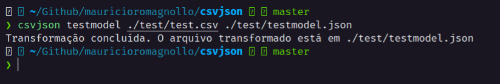
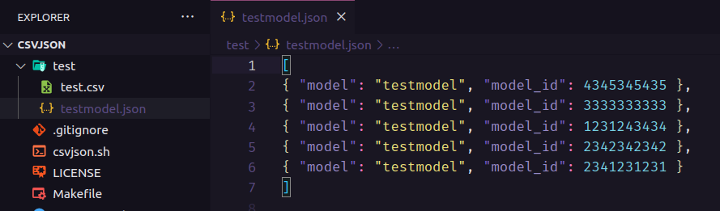

# csvjson

Auxiliar de marreta para converter csv para json. A proposta é criar um comando novo no terminal para auxiliar na criação de arquivo .json a partir de um .csv.

Para adicionar o novo comando no linux, basta rodar:

```sh
make command
```

Após executar, você terá o comando disponível no terminal:

```sh
csvjson <model_name> <csv_file_name_or_path> <output_file_name>
```

## Exemplo de Uso


